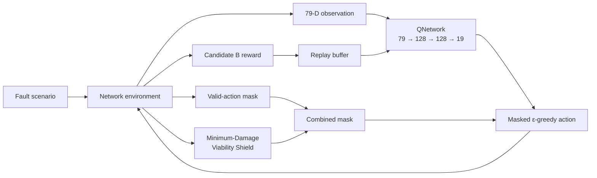

# 🛡️ Network Self-Healing with Safe DQN

> **Minimum-Damage Viability Shield를 결합한 안전 강화학습 기반 네트워크 자동 복구 연구**

[](https://www.python.org/)
[](https://pytorch.org/)
[](#-테스트)
[](#-multi-seed-통계-검증)
[](#-minimum-damage-viability-shield)

이 프로젝트는 VLAN 설정 장애가 발생한 네트워크에서 에이전트가 장애를 진단하고 구성을 자동 복구하도록 학습합니다. Vanilla DQN과 Safe DQN을 동일한 transition budget에서 비교하며, Safe DQN은 복구 과정에서 발생할 수 있는 추가 서비스 손상을 viability shield로 제한합니다.

---

## ✨ 핵심 결과

고정된 51개 unseen fault scenario를 대상으로 평가했습니다.

| 실험 | Functional recovery | Total damage | Safety gap | Mean steps | Timeout |
|---|---:|---:|---:|---:|---:|
| Vanilla DQN, seed 2026 | 51/51 | 12 | 3 | 4.255 | 0% |
| Safe DQN, 3,000 episodes | 50/51 | 9 | 0 | 4.706 | 1.96% |
| **Safe DQN, 35,747 transitions** | **51/51** | **9** | **0** | **4.255** | **0%** |

10-seed transition-budget 통제 실험:

- Safe DQN은 **9/10 seeds에서 51/51 recovery와 safety gap 0**을 동시에 달성했습니다.
- Vanilla DQN은 **7/10 seeds에서 51/51 recovery**를 달성했습니다.
- Eval-51 total damage는 Vanilla `17.10 ± 8.65`, Safe `8.40 ± 1.90`이었습니다.
- Paired Wilcoxon: `W=1.0`, `p=0.0078125`, rank-biserial effect size `0.9556`.
- Safe seed 2033에서는 `3/51 recovery`의 catastrophic liveness failure가 발견됐으며, 제외하지 않고 원시 데이터에 보존했습니다.

> [!IMPORTANT]
> Safe seed 2033의 damage 3은 더 안전해서가 아니라 대부분의 scenario를 복구하지 않았기 때문입니다. Damage는 반드시 recovery와 함께 해석해야 합니다.

---

## 🧭 시스템 개요



### 네트워크와 장애 공간

- 스위치 2대, 호스트 4대, VLAN 10/20, 스위치 간 trunk
- 독립적인 원자 장애 8개: access VLAN 반전 4개 + trunk VLAN 제거 4개
- 비어 있지 않은 모든 장애 조합: `2⁸ - 1 = 255`
- Stratified split: **Train 204 / Eval 51**, intersection 0
- 모든 학습 seed에서 split seed는 **2026으로 고정**

### 상태와 행동

| 항목 | 구성 |
|---|---|
| Observation | 79차원 `float32` 벡터 |
| Action space | 19개 discrete actions |
| QNetwork | `79 → 128 → 128 → 19` |
| Configuration actions | Access VLAN 설정, trunk VLAN allow/remove |
| Control actions | Diagnose, rollback, declare done |
| Episode limit | 30 steps |

Observation에는 현재 포트 구성, link 상태, 진단 결과와 step count가 포함됩니다. Scenario ID, fault 원인, 정답 action, `policy_healthy` 같은 privileged 정보는 에이전트에게 제공하지 않습니다.

---

## 🧠 DQN 학습 설정

Vanilla와 Safe DQN은 shield 적용 여부를 제외하고 같은 조건을 사용합니다.

| Parameter | Value |
|---|---:|
| Batch size | 64 |
| Replay capacity / warmup | 10,000 / 1,000 |
| Gamma / learning rate | 0.99 / 0.001 |
| Epsilon | 1.0 → 0.05 |
| Epsilon decay | 20,000 transitions |
| Target sync | 500 transitions |
| Training budget | **35,747 transitions** |
| Device | CPU |

Replay transition은 다음 상태의 action mask도 저장합니다. True MDP termination에서만 Bellman bootstrap을 중단하며, time-limit truncation과 외부 budget cut에서는 viable next action으로 bootstrap합니다.

---

## 🛡️ Minimum-Damage Viability Shield

Shield는 256개 canonical configuration state에서 functional goal까지 필요한 최소 추가 손상 비용 `J*(s)`를 계산합니다. State-changing action은 다음 조건을 만족할 때만 허용됩니다.

```text
N(s, a) + J*(s′) = J*(s)
```

- `N(s, a)`: action이 즉시 새로 손상시키는 policy 수
- `J*(s′)`: successor에서 goal까지 필요한 최소 추가 손상
- `valid_mask AND safety_mask = combined_mask`

Combined mask는 exploration, greedy action selection, Bellman next-action maximization에 동일하게 적용됩니다.

확인된 invariant:

- Viability violation: **0**
- Empty combined mask: **0**
- Eval theoretical minimum total damage: **9**
- 정상 수렴한 Safe seed의 realized damage: **9**

Shield는 minimum damage를 보장하지만 진행 자체를 강제하지 않습니다. Diagnose 같은 self-loop action이 높은 Q-value를 가지면 liveness failure가 발생할 수 있습니다.

---

## 📊 Multi-seed 통계 검증

| Metric across 10 seeds | Vanilla | Safe |
|---|---:|---:|
| Functional recovery | 97.25% ± 4.91% | 90.59% ± 29.76% |
| Perfect 51/51 seeds | 7/10 | **9/10** |
| Total damage/run | 17.10 ± 8.65 | **8.40 ± 1.90** |
| Mean damage/scenario | 0.335 ± 0.170 | **0.165 ± 0.037** |
| Mean steps | 5.375 ± 1.444 | 6.741 ± 7.800 |
| Mean return | 8.314 ± 0.746 | 7.520 ± 4.308 |
| Timeout | 2.75% ± 4.91% | 9.61% ± 30.38% |
| Configuration recovery | 38.24% ± 31.53% | 46.86% ± 19.70% |

Safe 평균의 큰 분산은 seed 2033의 liveness collapse 때문입니다. 나머지 9개 Safe seed는 모두 51/51 recovery와 damage 9를 달성했습니다.

### Severity별 집계

| Severity | Algorithm | Recovery | Mean damage | Mean steps |
|---|---|---:|---:|---:|
| Low | Vanilla | 95.00% | 0.700 | 4.350 |
| Low | Safe | 95.00% | **0.000** | 4.800 |
| Medium | Vanilla | 95.88% | 0.447 | 5.335 |
| Medium | Safe | 90.00% | **0.212** | 6.388 |
| High | Vanilla | 98.13% | 0.253 | 5.459 |
| High | Safe | 90.63% | **0.150** | 7.050 |

원시 결과와 통계:

- [`multiseed_eval_scenario_results.csv`](results/multiseed/multiseed_eval_scenario_results.csv) — 20 runs × 51 scenarios
- [`multiseed_eval_seed_summary.csv`](results/multiseed/multiseed_eval_seed_summary.csv) — seed별 Eval 집계
- [`multiseed_training_summary.csv`](results/multiseed/multiseed_training_summary.csv) — 학습 및 안정성 지표
- [`multiseed_statistical_summary.json`](results/multiseed/multiseed_statistical_summary.json) — 통계·severity·scenario 분석
- [`multiseed_reproducibility.json`](results/multiseed/multiseed_reproducibility.json) — seed 2027 결정성 검증

---

## 🚀 설치와 실행

### 환경 준비

```bash
python -m venv .venv

# Windows PowerShell
.venv\Scripts\Activate.ps1

python -m pip install -r requirements.txt
```

통계 분석까지 다시 실행하려면 SciPy가 필요합니다.

```bash
python -m pip install scipy
```

### 🧪 테스트

```bash
python -m pytest -q
```

현재 기준: **109 passed**

### 단일-seed 실행

```bash
# Vanilla DQN
python -m experiments.train_dqn

# Safe DQN exact transition-budget experiment
python -m experiments.train_safe_dqn_stepbudget
python -m experiments.analyze_safe_dqn_stepbudget
```

### Multi-seed 실행

```bash
python -m experiments.run_multiseed_training vanilla 2026
python -m experiments.run_multiseed_training safe 2026

# 2026–2035 checkpoint가 준비된 후
python -m experiments.analyze_multiseed
python -m experiments.check_multiseed_reproducibility
```

> [!NOTE]
> Multi-seed 명령은 같은 이름의 checkpoint를 덮어쓸 수 있습니다. 기존 결과를 보존하려면 실행 전에 복사하세요.

---

## 🗂️ 프로젝트 구조

```text
.
├── agents/
│   ├── dqn.py                         # QNetwork와 masked DQN agent
│   └── replay_buffer.py               # next-action mask 포함 replay buffer
├── baselines/                         # Rule-based / oracle baselines
├── config/                            # 기준 topology와 scenario
├── env/
│   ├── actions.py                     # 19개 action
│   ├── faults.py                      # 255개 fault 조합과 split
│   ├── network_env.py                 # 환경, reward, rollback, damage metrics
│   ├── observation_encoder.py         # 79차원 encoder
│   └── simulator.py                   # network/policy simulator
├── safety/
│   └── viability_shield.py            # J*와 admissibility 계산
├── experiments/
│   ├── train_dqn.py                   # Vanilla trainer
│   ├── train_safe_dqn.py              # Safe trainer
│   ├── train_*_stepbudget.py           # Exact-budget trainers
│   ├── evaluate_*.py                  # Hold-out evaluators
│   ├── run_multiseed_training.py      # Seed별 frozen run
│   └── analyze_multiseed.py           # Paired 통계 분석
├── results/multiseed/                 # 20 checkpoints와 통계 산출물
└── tests/                              # 109 regression/safety tests
```

---

## 📐 평가 지표

| Metric | 의미 |
|---|---|
| Functional recovery | 모든 연결 policy가 다시 정상인지 여부 |
| Configuration recovery | 최종 구성이 reference와 정확히 같은지 여부 |
| New policy damage | 복구 action으로 새롭게 손상된 host-pair policy 수 |
| Safety optimality gap | Realized damage − theoretical recovery minimum |
| Incorrect declare | 복구 전에 `declare_done`을 실행한 비율 |
| Timeout | 30-step 제한까지 복구하지 못한 비율 |
| Shield intervention | Valid-only 최고 Q action이 shield에 의해 차단된 횟수 |

Functional recovery와 configuration recovery는 의도적으로 구분됩니다. 기능적으로 복구됐더라도 reference와 다른 동등한 안전 구성을 선택할 수 있습니다.

---

## 🔬 재현성과 한계

Safe seed 2027 독립 재학습에서 online/target parameter, Eval-51 결과와 전체 action trajectory가 모두 일치했습니다.

이번 실험은 single-seed 의존성과 stochastic variability를 검증했지만 다음 한계가 남아 있습니다.

- 고정된 2-switch/4-host topology
- 같은 topology 내 unseen fault 조합만 평가
- 제한된 VLAN fault 유형과 완전한 configuration observability
- 정확한 simulator/policy evaluator 의존 및 실제 네트워크 model mismatch
- 대규모 state space에서 exact shield의 확장성
- Shield가 safety는 보장하지만 liveness는 보장하지 않음

다음 연구 단계는 seed 2033의 diagnose/self-loop Q dominance, replay composition과 post-floor policy 변화를 사후 분석하는 것입니다.

---

## 📍 프로젝트 상태

```text
QNetwork                  ✅
Replay Buffer             ✅
Vanilla DQN               ✅
Candidate B Reward        ✅
Training / Eval           ✅
Viability Shield          ✅
Safe DQN                  ✅
Transition-Budget Control ✅
10-Seed Statistical Eval  ✅
Real Network Validation   ⏳
```

> 이 저장소는 현재 **연구용 simulator 단계**입니다. 실제 네트워크에 적용하기 전 별도의 testbed 검증과 failure containment 설계가 필요합니다.

<!-- Legacy README content retained below only to avoid destructive replacement of the original bytes.

Safe Reinforcement Learning 기반 네트워크 설정 장애 자동 진단 및 복구 연구를 위한 순수 Python 실험 환경이다. 현재 Vanilla DQN 구성 요소와 delta 기반 reward까지 구현되어 있다.

## 현재 범위

- 스위치 2대, 호스트 4대, VLAN 10/20, 스위치 간 trunk
- 고정된 19개 이산 행동과 상태 기반 action mask
- 미진단/성공/실패 연결성 관측과 단계별 rollback
- Rule-Based 및 Configuration Diff baseline
- 고정 시나리오 6개와 생성 가능한 장애 조합 255개
- 기능 복구와 설정 복구를 분리한 평가 및 CSV 저장
- seed manifest를 저장하는 legacy/stratified train-eval split
- DQN 입력 준비용 79차원 NumPy observation encoder
- 복구 과정의 누적·고유·최종 서비스 손상 지표

QNetwork, Replay Buffer, Vanilla DQN Agent, 약한 safety-aware reward와 재현 가능한 Training Loop가 구현되어 있다. Safe DQN과 Mininet 검증은 아직 구현하지 않는다.

## 설치와 테스트

Python 3.10 이상을 권장한다.

```bash
python -m venv .venv
python -m pip install -r requirements.txt
python -m pytest -q
```

## 장애 조합

Phase 2.5는 다음 8개의 독립적인 원자 장애를 사용한다.

- 4개 access 포트의 VLAN 10/20 반전
- SW1/SW2 trunk에서 VLAN 10 또는 VLAN 20 누락

각 원자 장애는 설정의 서로 다른 한 항목을 변경한다. 비어 있지 않은 모든 부분집합을 생성하므로 고유 장애 조합 수는 `2^8 - 1 = 255`개다. 정상 상태는 별도의 `normal` 사례이며 이 수에 포함하지 않는다.

분류 기준:

- 유형: `single_access`, `single_trunk`, `multi_access`, `multi_trunk`, `access_trunk_combined`
- 심각도: 원자 장애 1개는 `low`, 2~3개는 `medium`, 4개 이상은 `high`
- 영향: 연결성 또는 VLAN 격리 정책을 실제로 깨뜨리면 functional fault, 설정만 다르고 정책이 정상이라면 configuration-only fault

`FaultDataset`은 canonical scenario ID를 SHA-256으로 고정 분할한다. 따라서 train/eval 구분은 sampling seed와 독립적이고 동일 조합이 양쪽에 나타나지 않는다. 현재 분할은 train 202개, eval 53개이며 eval은 학습에서 제외된 조합만 포함한다. seed는 각 split 안에서 재현 가능한 표본을 선택할 때만 사용한다.

현재 분포에서 train은 low 8개, medium 74개, high 120개이고 eval은 medium 10개, high 43개다. 따라서 eval이 의도상 더 어려운 조합으로 구성되지만, 작은 토폴로지에서 파생된 유한 조합이라는 한계가 있다.

Phase 2.6의 stratified split은 severity와 fault type 조합별로 가능한 경우 train/eval 양쪽에 사례를 배치한다. 기본 seed는 2026이며 train 204개, eval 51개다. train 분포는 low 6/medium 67/high 131, eval 분포는 low 2/medium 17/high 32다. 조합 ID와 seed는 `results/stratified_split_manifest.json`에 저장된다. 원소가 하나뿐인 세부 stratum은 중복 없이 양쪽에 배치할 수 없으므로 train에 남긴다.

## 관측과 정보 접근 권한

reset 직후 연결성 관측은 모두 `unknown`이다. 진단 후에만 `success` 또는 `failure`가 공개되고, 설정 변경이나 rollback 뒤에는 기존 결과가 다시 `unknown`으로 무효화된다. observation에는 scenario ID, 장애 원인, 기준 설정, `policy_healthy`가 없다.

Rule-Based는 observation, 진단 결과와 현재 유효 행동만 사용한다. Configuration Diff만 `REFERENCE_PORTS`를 읽는 Oracle 비교군이다. 기능/설정 복구 판정은 `experiments/evaluation.py`에 분리되어 알고리즘 입력으로 사용되지 않는다.

다만 현재 포트 설정 자체는 완전히 관측 가능하며 토폴로지가 매우 작고 대칭적이다. 반복 관찰을 통해 정답 VLAN 패턴을 쉽게 추론하거나 암기할 가능성이 있다. 향후에는 포트 역할 인코딩, 관측 이력, 진단 비용, 제한적/노이즈 진단, topology permutation 중 어떤 부분 관측 모델을 사용할지 연구자가 결정해야 한다. Phase 2.5에서는 관측 구조를 변경하지 않았다.

## Observation Encoder

`env/observation_encoder.py`는 기존 dictionary observation만 읽어 shape `(79,)`, dtype `float32` NumPy 배열을 만든다. 입력 dictionary를 변경하지 않으며 기준 설정, 장애 ID, 실제 원인, 정답 행동과 `policy_healthy`를 추가하지 않는다.

인덱스 구성:

- `0..35`: 고정 포트 순서 `SW1:eth1, eth2, eth3, SW2:eth1, eth2, eth3`; 각 포트마다 `mode_access, mode_trunk, access_vlan_10, access_vlan_20, trunk_allows_10, trunk_allows_20`
- `36..41`: 같은 포트 순서의 link-up 값
- `42..77`: `H1..H4` source/destination 방향성 12개 pair; 각 pair마다 `unknown, success, failure` one-hot
- `78`: 현재 `step_count`

`ObservationEncoder.feature_names()`가 79개 인덱스의 이름을 동일 순서로 반환한다. 현재 observation history는 포함하지 않으므로 과거 진단이나 행동이 필요한 상태는 하나의 벡터만으로 구별할 수 없다.

## Action Mask와 종료

action ID는 항상 `0..18`이고 mask 인덱스와 일치한다. 진단과 완료 선언은 항상 허용되며 rollback은 실제 변경 이력이 있을 때만 허용된다. 따라서 episode 진행 중 유효 행동이 전혀 없는 상태는 없다. mask는 현재 설정 및 rollback 이력만 사용하고 기준 설정을 참조하지 않는다.

완료 선언은 진단을 선행 조건으로 요구하지 않는다. 미복구 상태에서 선언해도 `terminated=True`가 되지만 `recovery_success=False`이고 평가 결과는 `incorrect_completion`이다. 30 step 도달은 `truncated=True`와 `max_steps_exceeded`로 구분된다. 종료 뒤 추가 `step()` 호출은 기존처럼 오류가 발생한다.

## 정상 서비스 손상 지표

기존 `healthy_network_impacts`는 새 손상을 한 번 이상 만든 설정 변경 행동 수로 유지한다. 추가 지표는 다음과 같다.

- `initial_damaged_policies`: 장애 주입 직후 이미 손상된 host-pair 정책 수
- `new_policy_damage_events`: 행동 전 정상에서 행동 후 손상으로 바뀐 pair의 누적 횟수
- `unique_newly_damaged_policies`: 복구 과정에서 새로 손상된 고유 pair 수
- `service_damage_actions`: 하나 이상의 새 손상을 만든 상태 변경 행동 수
- `continuously_healthy_policies`: 초기부터 현재까지 계속 정상인 pair 수
- `final_damaged_policies`: 종료 시점에 손상된 pair 수
- `post_recovery_damage_events`: 전체 기능 복구 상태에서 다시 장애 상태로 전환된 횟수

이 판정은 환경/평가 내부에서만 수행하며 observation에는 포함되지 않는다. 같은 pair가 복구 후 다시 손상되면 누적 이벤트는 증가하지만 고유 pair 수는 증가하지 않는다.

## Baseline

Rule-Based는 양쪽 스위치의 동일 이름 access 포트 VLAN 일관성, 스위치 내부 VLAN 분리, 사용 중인 access VLAN의 trunk 허용 규칙을 적용한다. Configuration Diff는 현재 설정과 기준 설정의 차이만 변경한다. 후자는 정답 설정을 아는 Oracle이므로 향후 DQN과 동등한 정보 조건의 비교군이 아니다.

## 실험 실행

고정 6개 시나리오:

```bash
python -m experiments.runner
```

255개 확장 조합 전체:

```bash
python -m experiments.extended_runner
```

기본 `ExtendedExperimentRunner`는 legacy split을 재현한다. 모듈 실행은 seed 2026 stratified split을 평가하여 `results/stratified_baseline_results.csv`와 manifest를 저장한다. 기존 결과는 `results/extended_baseline_results.csv`에 보존된다. CSV는 episode, 장애 유형 평균, 심각도 평균, 전체 평균을 구분한다. `python_simulation_seconds`는 Python 벽시계 시간이며 실제 네트워크 복구 시간이 아니다.

## 주요 파일

- `config/`: 기준 토폴로지와 기존 고정 시나리오
- `env/faults.py`: 조합 생성, 분류, 고정 train/eval 분리와 seed 표본 추출
- `env/network_env.py`: 19개 행동 환경, 진단, mask, rollback
- `env/observation_encoder.py`: 공개 observation의 79차원 결정적 인코딩
- `baselines/`: observation-only Rule-Based와 Oracle Configuration Diff
- `experiments/evaluation.py`: 기능 및 설정 복구의 privileged 평가
- `experiments/extended_runner.py`: 확장 조합 평가와 집계 CSV
- `tests/`: Phase 1~2.5 회귀 및 기능 테스트
